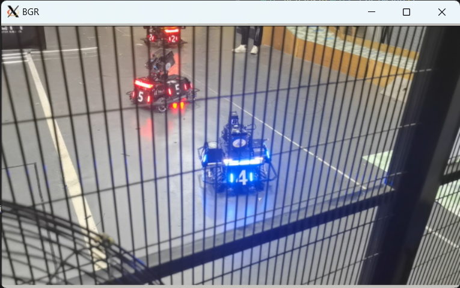
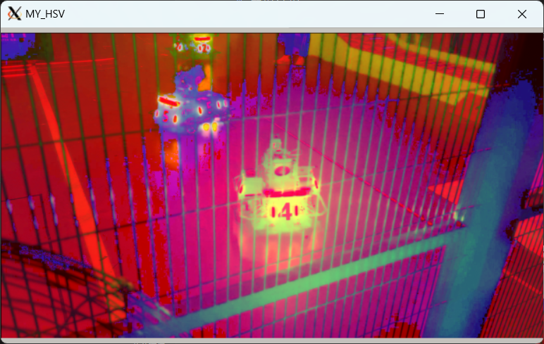
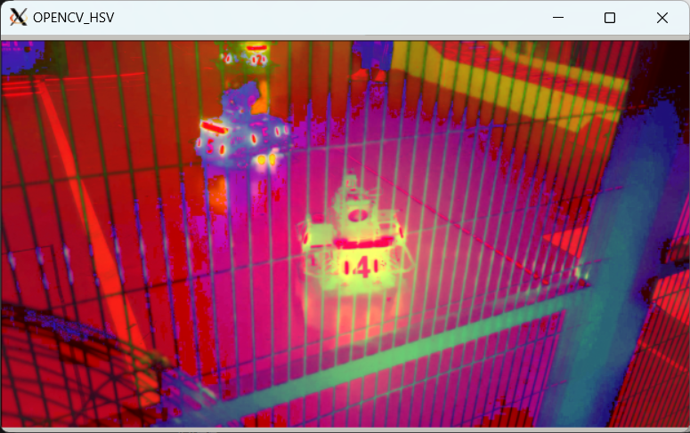

#### 任务一
**使用opencv的at方法，操作图像的每个像素点，并实现一幅图像从RGB色彩空间转换成HSV色彩空间或灰度图；**
* 实现过程
    1. RGB转HSV的公式：
    2. 实现了`Mat RGB2HSV(Mat& srcImage)`函数，在双重循环内使用at方法遍历图像的每一个像素点，带入RGB转HSV的公式即可
* 运行结果
    
    *原始图像*
    
    *自己实现的`BGR2HSV`效果*
    
    *调用 opencv `cvtColor`方法转换颜色空间*
    * 对比发现效果与opencv库函数相同，说明结果正确