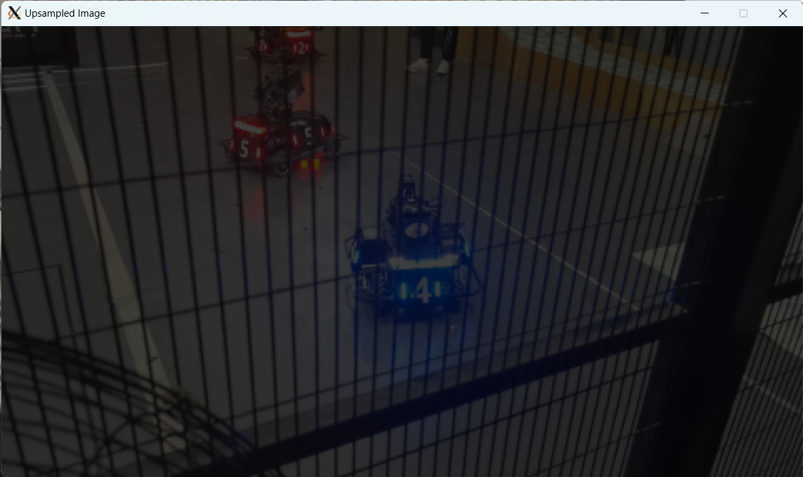
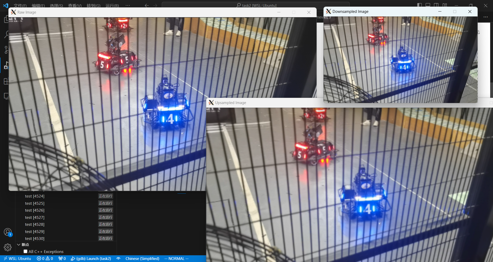
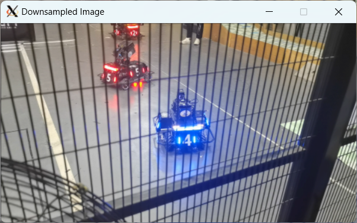
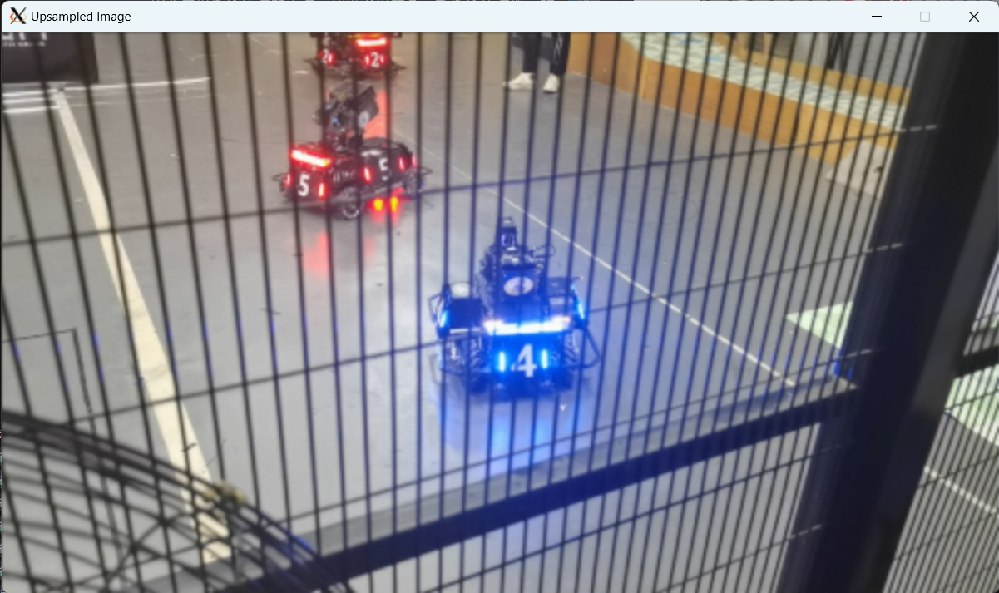

#### 任务二
**使用opencv的at方法，操作图像的每个像素点，实现图像任意比例的缩放（图像金字塔）**
* 实现过程
    1. 图像金字塔中的上下采样原理:
    图像上采样：为了增加图像的分辨率，先对图像进行插零（或者插值）在进行低通滤波。
    图像下采样：为了降低图像的分辨率，先对图像进行低通滤波，在对图像抽样。
    2. 需要实现低通滤波的方法，这里采用的是高斯低通滤波器，首先实现`GetGaussianKernel`带入公式获得高斯核，在实现`My_Blur`方法实现对图像卷积，进行低通滤波。 
    3. 然后分别实现了`My_PyrDown`和`My_PyrUp`对图像进行下采样和上采样
    在`My_PyrDown`函数中获得高斯核，然后直接对图像滤波，得到分辨率更低的图像
    在`My_PyrUp`函数中使用了双线性插值进行上采样，然后调用`My_Blur`低通滤波
    **注：原来使用的方法是先插零再低通滤波，但是发现结果图像相比原图变暗，而且由于滤波效果不好会产生小黑点，所以采用双线性插值的方法，如图：**
    

* 运行结果

*先对原始图像下采样到原图像大小的一半，然后再上采样*

*原始图像*

*下采样后的图像，图像分辨率降低*

*再次上采样后的图像，图像分辨率提高，但是与原始图像相比图像的清晰度降低，因为下采样与上采样不是互逆的过程，图像下采样的过程中会丢失掉原始图像的部分信息*