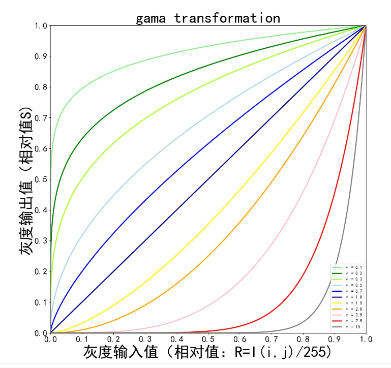
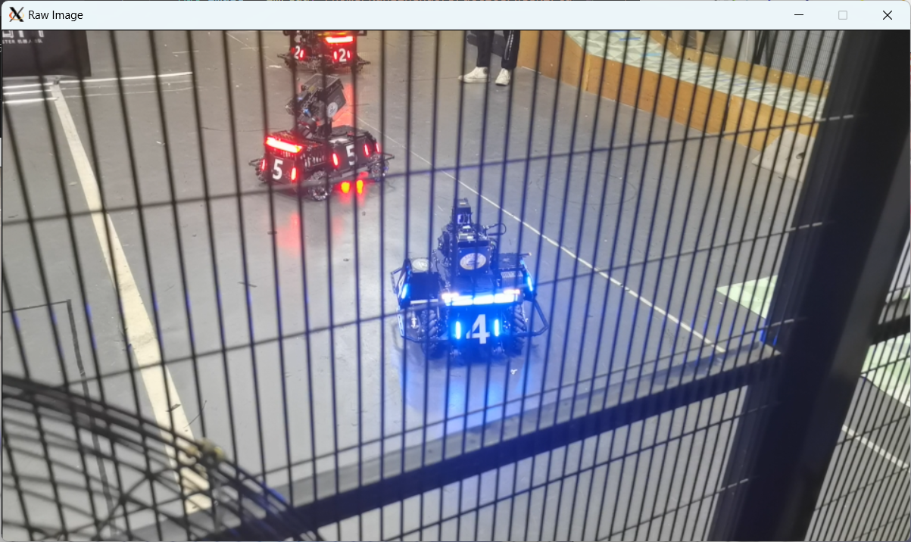
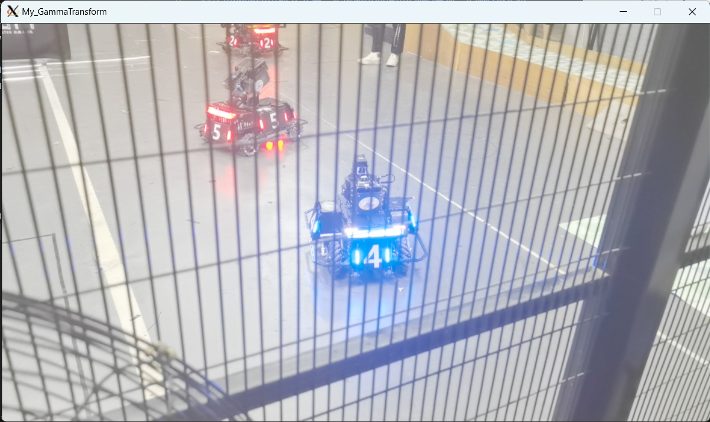

#### 任务四
**运用opencv中的at方法，实现图像处理中gamma变换，gamma矫正也是图像处理中的一种，可以有效优化图像中的亮度和对比度**
* 实现过程
    1. gamma 变换公式:
    >$y=cr^{\gamma}$

2. 首先将图像归一化到零到一的范围，然后带入gamma变换公式，最后乘以灰度级数变回颜色空间
* 实验结果
*原始图像*

*自己实现的gamma变化*

*调用opencv库函数实现gamma变换*
