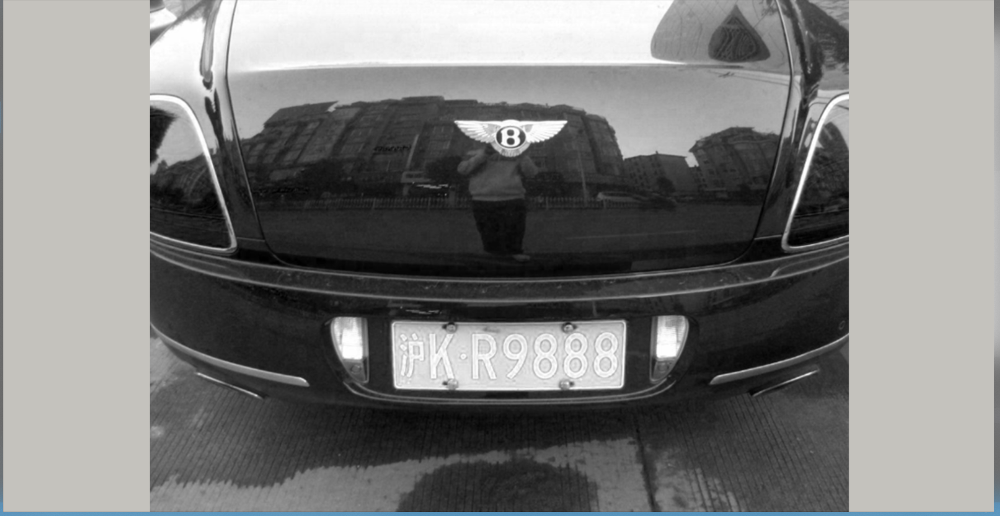
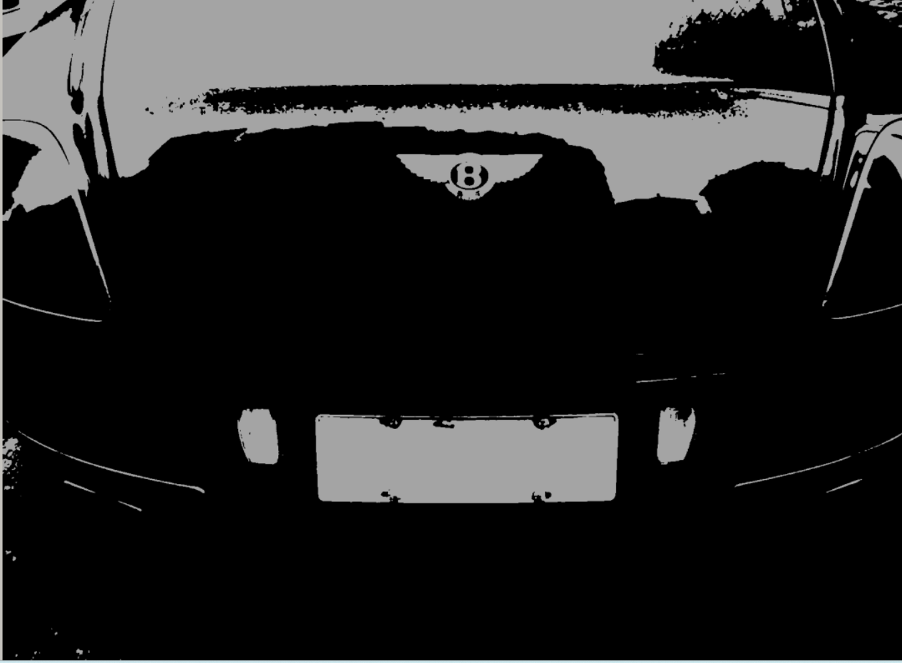
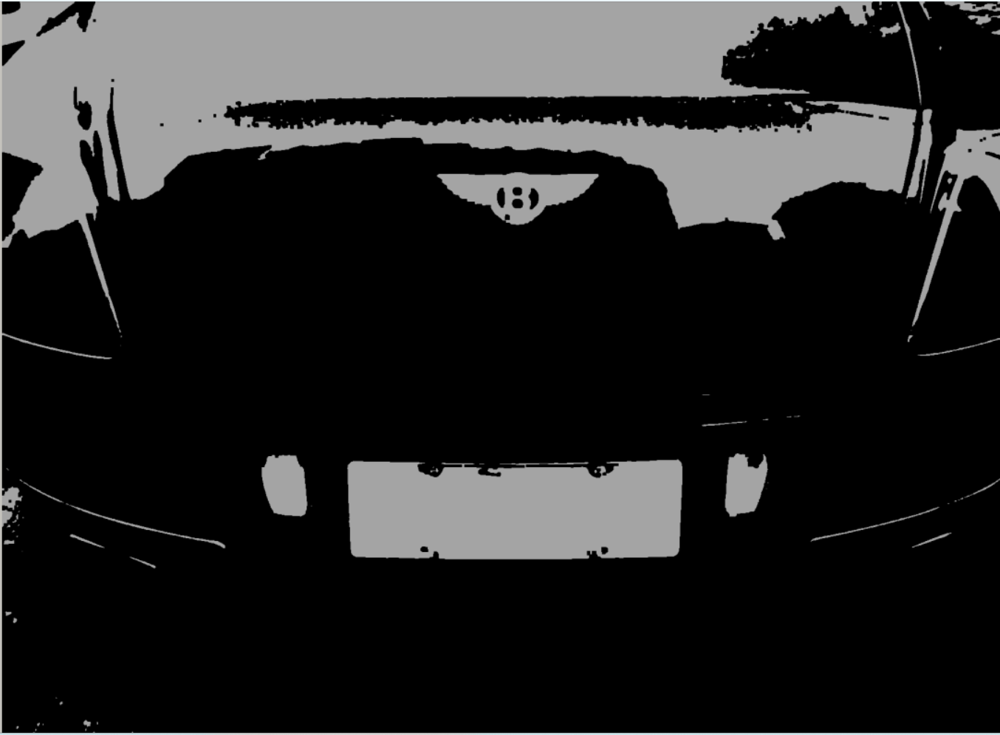
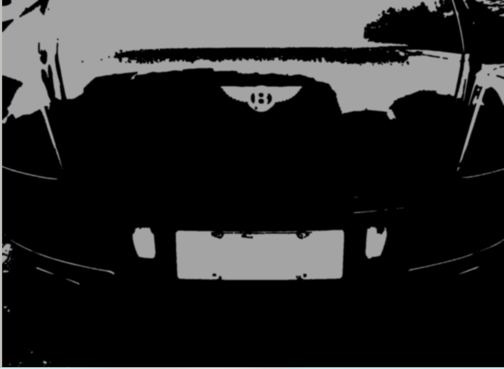
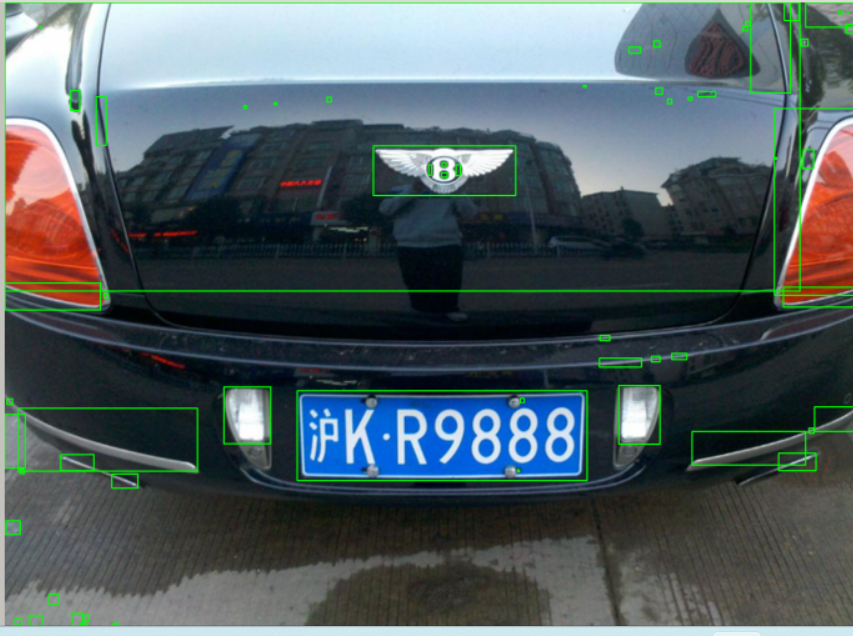
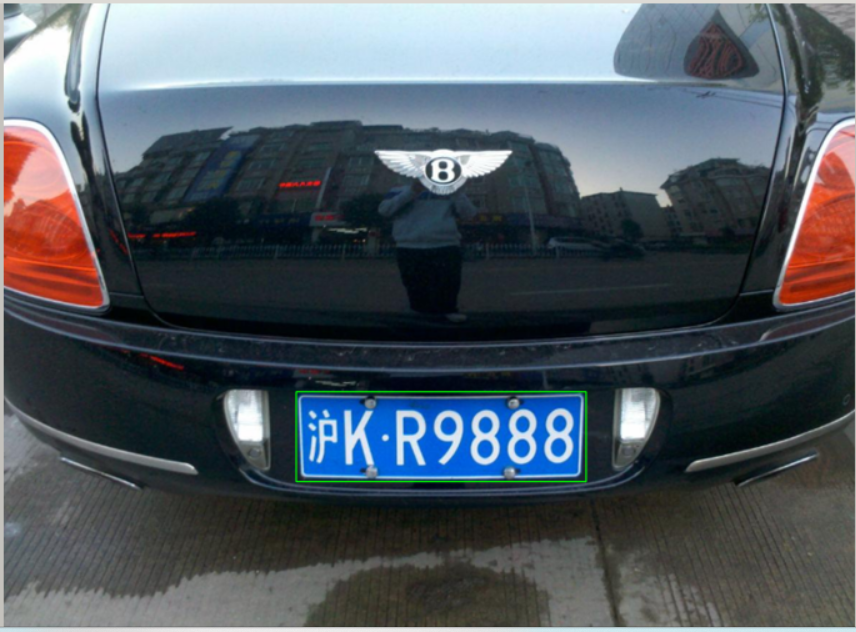

#### 任务三
**调用opencv函数库，框选并提取出下列照片中的车牌；用到的图像处理方法：色彩空间转换、二值化、形态学变换（膨胀腐蚀）、滤波、查找轮廓**
* 实现过程：
1. 图像处理步骤：
    1. 先进行色彩空间转换，把彩色图变换成灰度图，这里直接取了BGR的B分量，因为车牌以蓝色为主
    2. 对灰度图进行二值化，阈值分割得到二值图
    3. 进行形态学膨胀变换，增大车牌轮廓的清晰度
    4. 高斯低通滤波，滤除噪点干扰轮廓的识别
    5. 查找轮廓，过滤出车牌的轮廓
2. 调参过程：
    1. 确定重要的参数，包括二值化的阈值，高斯低通滤波的高斯核大小，过滤车牌轮廓形状的几何参数
    2. 确定这些参数的大致范围，减少调参范围，图像处理参数调整到使轮廓清晰呈现，车牌轮廓形状几何参数通过鼠标点击回调函数获得大概尺寸
    3. 控制单一变量，从图像处理过程从前往后调参，获得更为精确的参数
* 实验结果：
*分离蓝色单通道颜色空间*

*二值化阈值分割*

*膨胀处理加强边界*

*高斯模糊消除噪声*

*轮廓识别*

*轮廓筛选过滤*
